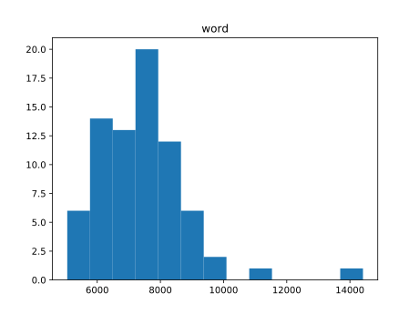

Tool for building epub/mobi ebook version of Domagoj Kurmaic's excellent Mother of Learning


Dependencies:
``` shell
sudo apt install pandoc                            # to reformat html
sudo apt install graphicsmagick-imagemagick-compat # to resize cover art

# to get mobi from epub
cd ..
version=kindlegen_linux_2.6_i386_v2_9.tar.gz
mkdir kindlegen && cd kindlegen
wget http://kindlegen.s3.amazonaws.com/${version}
tar xvf ${version}
sudo mv kindlegen /usr/local/bin

# to extract mobi7
cd ..
git clone git@github.com:kevinhendricks/KindleUnpack.git
```


